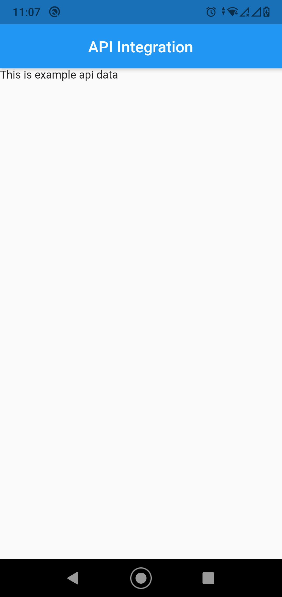

Its a simple data fetching app from api.

This is first page where data is a simple string:

This is second page where data is a list:

This is third page where data is complex json and I am showing from the json category and in facts image_URL, name and description:

